# ASSETS MANAGEMENT SYSTEM
A nodejs web application to track assets which are being used by a company's employees

## Project Screenshots & ENV variables

### Signup Page
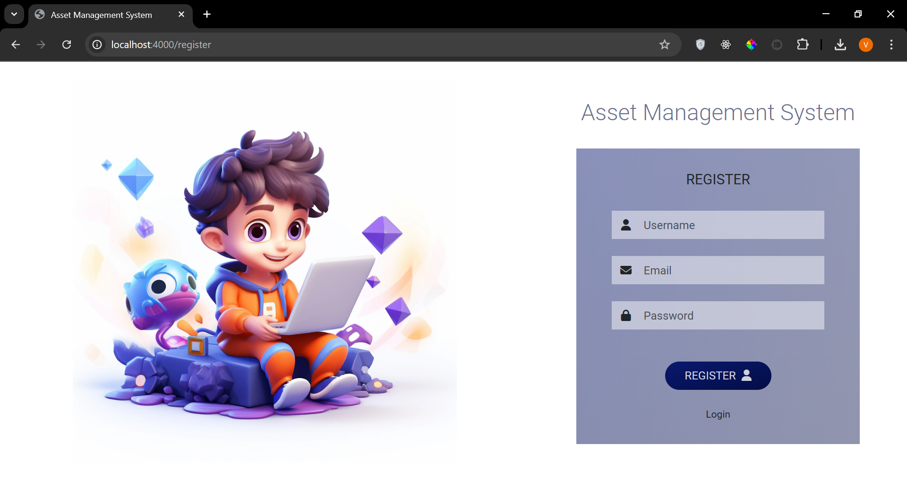

### Login Page
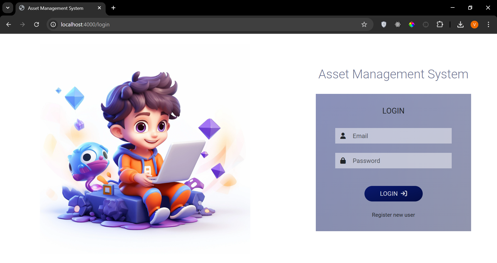

### Dashboard
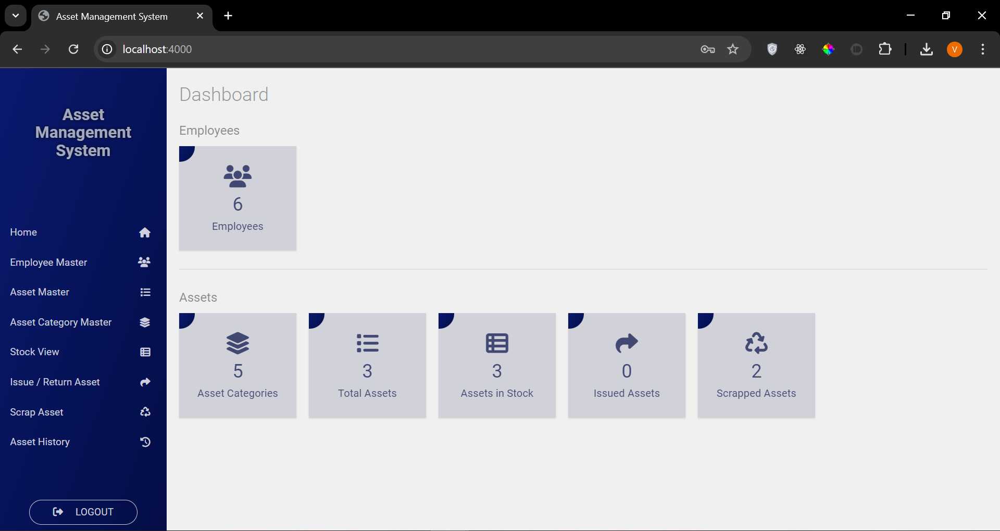

### Stock View
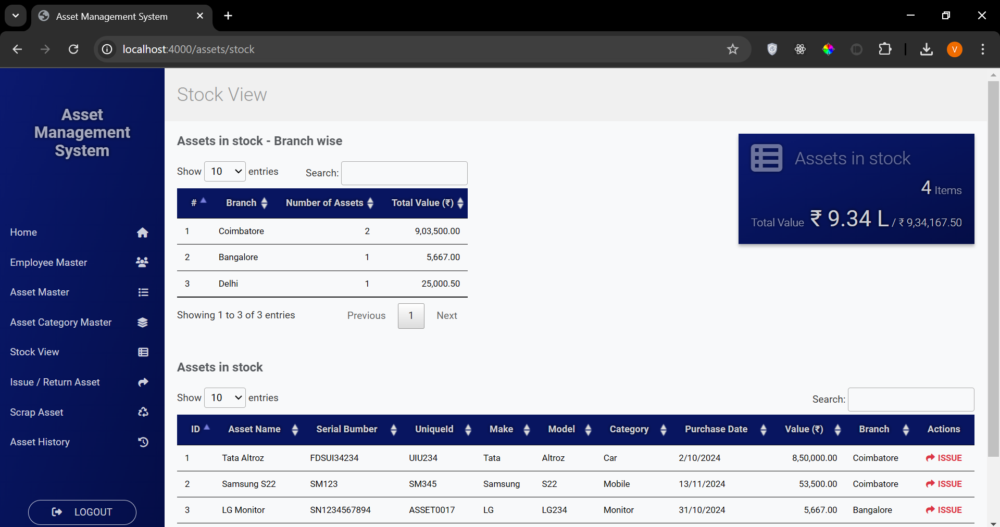

### Employee List
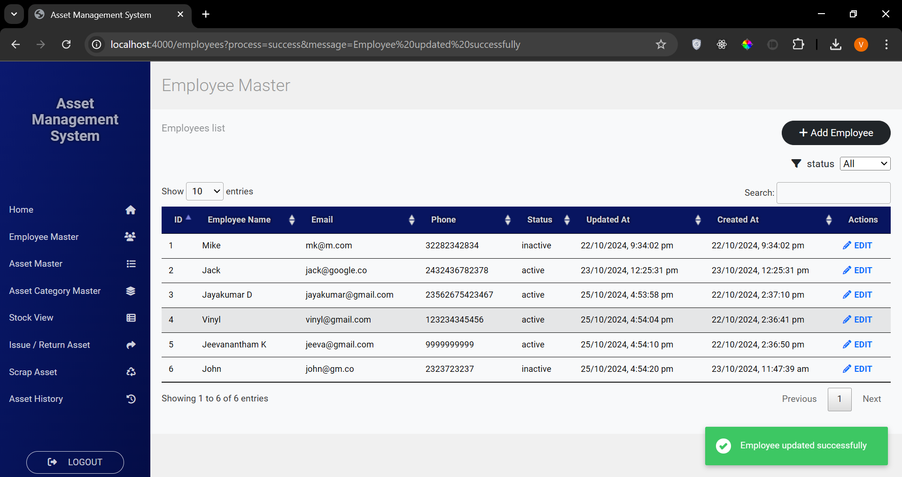

### Employee Form
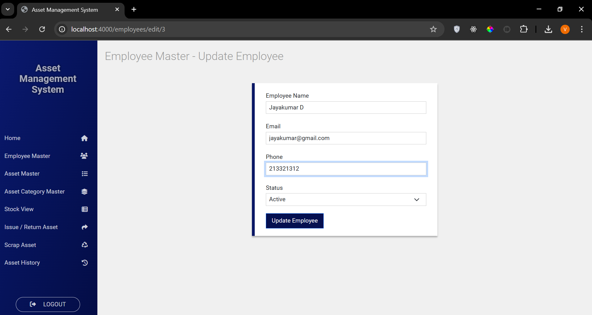

### Asset List
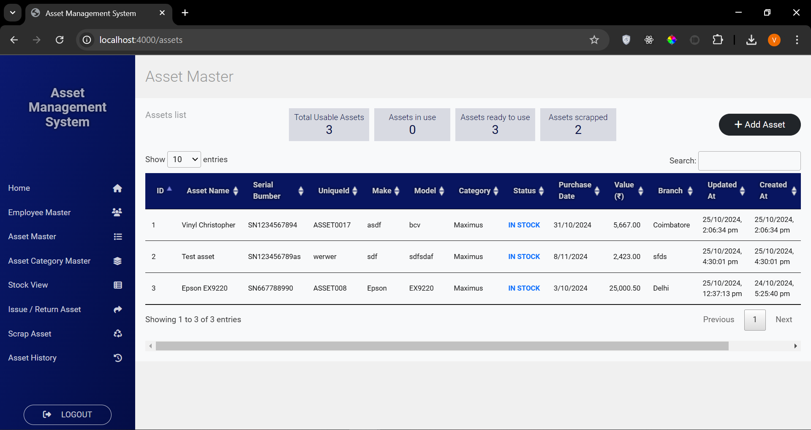

### Asset Form
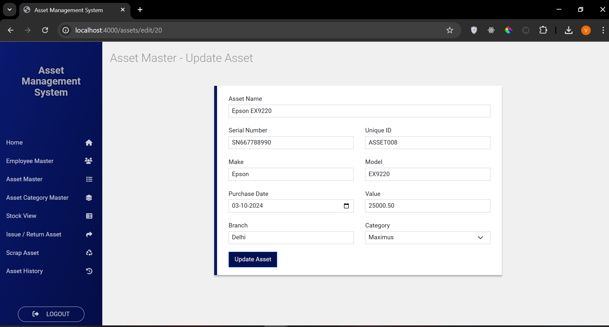

### Asset Category List
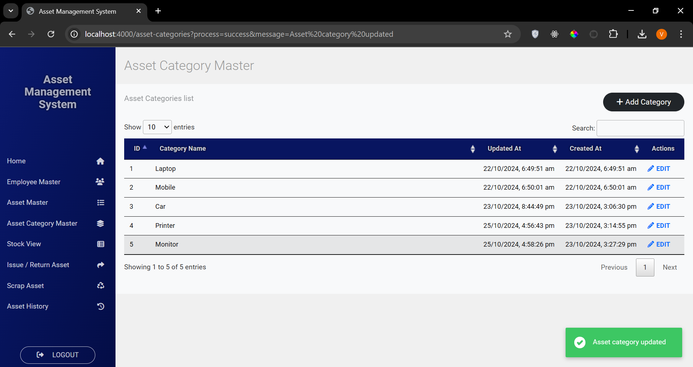

### Asset Category Form
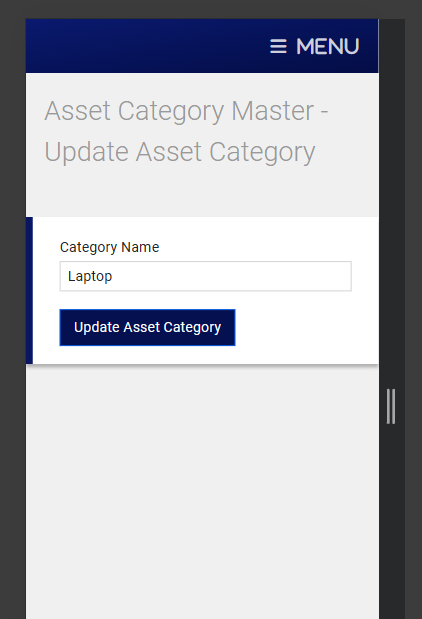

### Issue / Return Assets
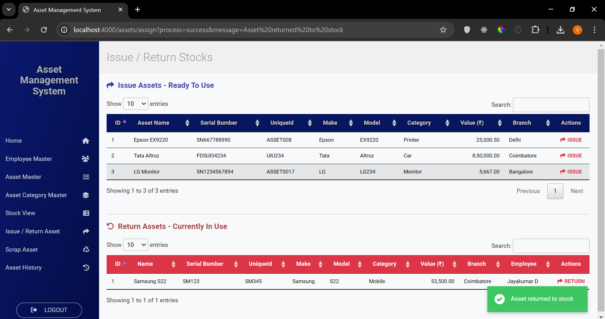

### Return Asset Form
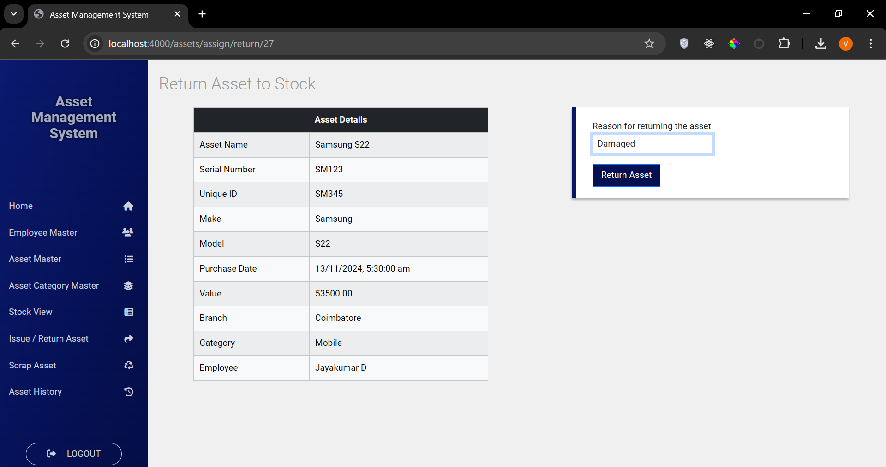
 
### Scrap List
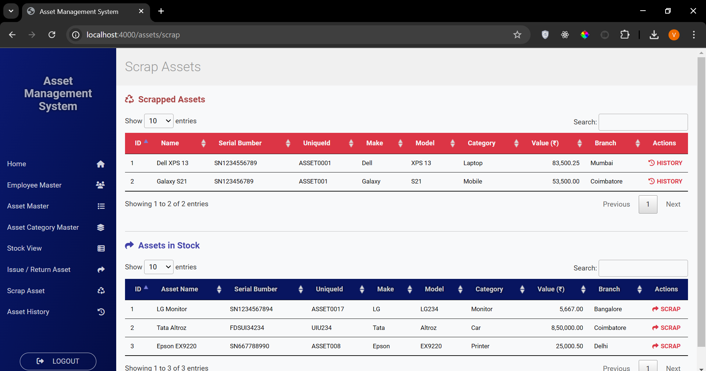

### Scrap Form
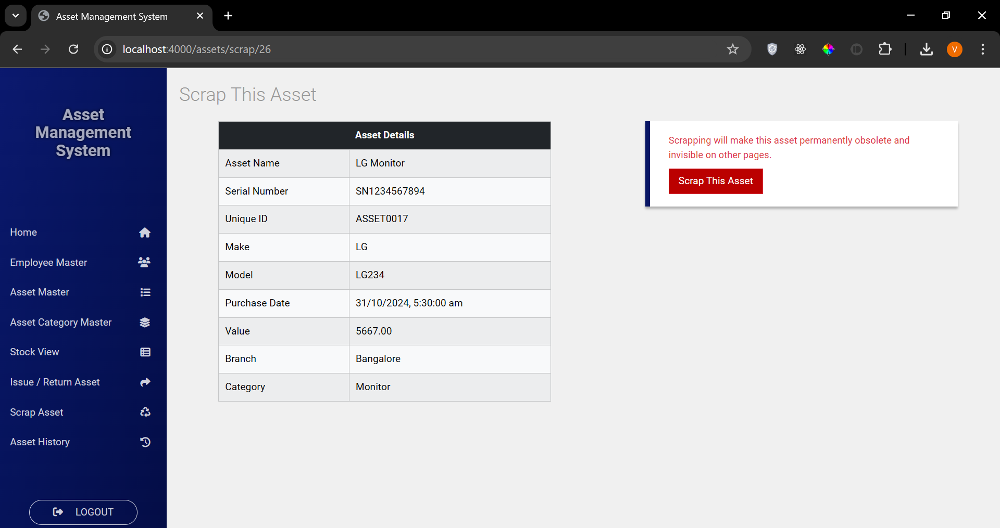

### Asset History List
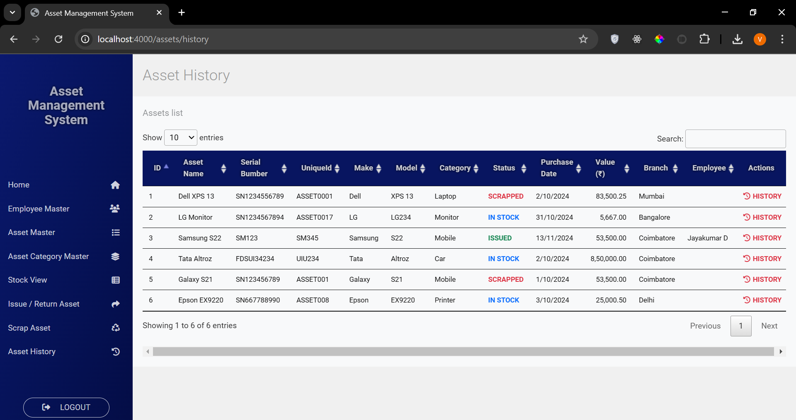

### Asset History
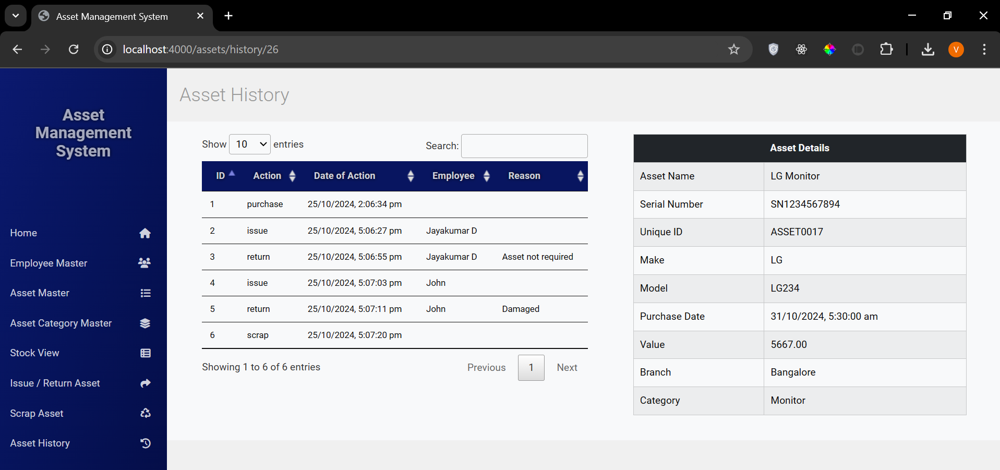

###  ENV Variables
PORT=4000 
PRODUCTION=false 
SESSION_SECRET_KEY=zxvhkjwfeiusdfaFASDFKJBASDFMNB23478 
DB_HOST=localhost 
DB_NAME=asset_management_system 
DB_USERNAME=postgres 
DB_PASSWORD=pgAdmin123 
